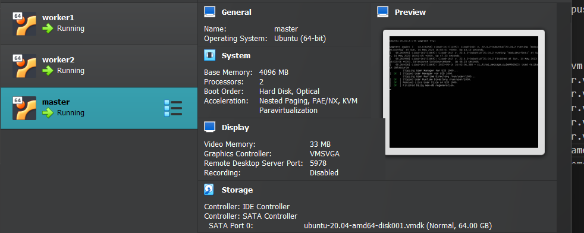
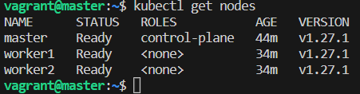

Install virtualbox and vagrant in your machine

clone this repo

go to the folder vagrant-kubeadm-setup created by git clone 

```
git clone https://github.com/avi1501/vagrant-kubeadm-kubernetes.git

```

`cd vagrant-kubeadm-kubernetes`

run command vagrant up

`vagrant up`

now give admin permission when asked by vagrant/virtualbox

your machines will start running check the virtualbox 



it will look something like this 

you can change the vm configuration accordingly

after when your all machine starts running successfully

run command from same folder

```
vagrant ssh master

```

above command to enter into master machine

and

below command to enter into worker machine

`vagrant ssh worker1`

to enter into worker1 machine

`vagrant ssh worker2`

to enter into worker2 machine


Open the install.sh file 

execute all commands one by one in all the three machines 

master , worker1, worker2

after you done with running all commands in install.sh

open file present in /etc/hosts

`sudo nano /etc/hosts`

add 

```
100.0.0.1 master.example.com master
100.0.0.2 worker1.example.com worker1
100.0.0.3 worker2.example.com worker2
```

these 3 lines at last 

for the internal domain name resolution

you can try pinging master and worker node from machine 

like 

you can run  for connection check 

```
ping master
```

`ping worker1`

```
ping worker2
```


---

now These steps only needs to be performed in master node 

run 

```
sudo kubeadm init --apiserver-advertise-address=100.0.0.1 --pod-network-cidr=10.244.0.0/16
```

it will generate a token like this

no need to copy below token 

for yours it will be different check last few lines when execution finished

`kubeadm join 100.0.0.1:6443 --token woen6j.kc0wz69i4pz3zt53 --discovery-token-ca-cert-hash sha256:799efe3af36881fad8850a4118b5ca8ff04efb4856d108bb9fdd037435bc5ca3`

save this token somewhere

run these commands 

1. `mkdir -p $HOME/.kube`

2. `sudo cp -i /etc/kubernetes/admin.conf $HOME/.kube/config`

3. `sudo chown $(id -u):$(id -g) $HOME/.kube/config`


now we need to setup networking between nodes 

run this command to install flannel yaml 

`wget https://raw.githubusercontent.com/coreos/flannel/master/Documentation/kube-flannel.yml`


> Note: at 14-05-2023

flannel file which we downloaded is working may be get depcrated

you can look for latest file of that time if this doesnt work

By default flannel and other kubernetes resolver uses eth0 for communication

but we  are using vm so we need to specify to use eth1 for communication 

edit this flannel.yml file

```
nano flannel.yml
```

add `--iface=eth1  ` in arguments

somewhere around 

in container flannel 

```
args:
        - --ip-masq
        - --kube-subnet-mgr
        - --iface=eth1
```

after --ip-masq 

    --kube-subnet-mgr


apply this file 

```
kubectl apply -f kube-flannel.yml
```

end of all commands for master node to setup 

no go on worker nodes 

paste the similar looking command which was generated you kubeadm init command 

which i told you to save earlier 

```
kubeadm join 100.0.0.1:6443 --token woen6j.kc0wz69i4pz3zt53 --discovery-token-ca-cert-hash sha256:799efe3af36881fad8850a4118b5ca8ff04efb4856d108bb9fdd037435bc5ca3
```

It will look similar to this 

after running this in all the worker node 

---

go back to master node and check the node status

kubectl get nodes



It will show ready 

Note: at 14-05-2023 

flannel file which we downloaded is working may be get depcrated 

you can look for latest file of that time if this doesnt work
